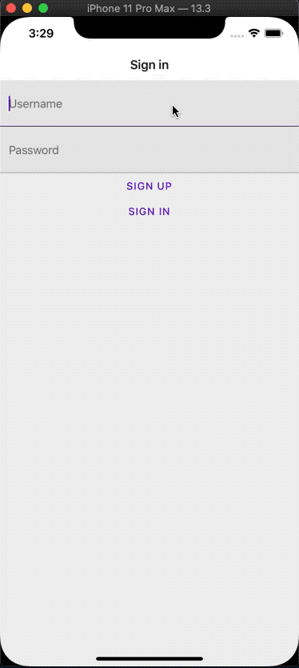

# react-native-starter
## The boiler plate leg work for building a React Native project with a DB and auth. 

### PRs are Welcome!

### Just the basics for what you need to get started with a RN app using: 
* Expo
* TypeScript
* React Native Paper (Material UI for RN)
* React Navigation 5
* Firebase 
  * Auth
  * Firestore

### Tested with : 
* Jest
* Testing Library - React Native
* Sinon

<h2 align="center">Here we go!</h2>
<p align="center">
  
</p>

## Code Style
Default component exports are generally wrapped in the `withFirebaseHOC` higher order component. 

Named exports most likely shouldn't be wrapped in a HOC, and are generally used for testing. 
```tsx
export default withFirebaseHOC(Thing);
export { Thing };
```